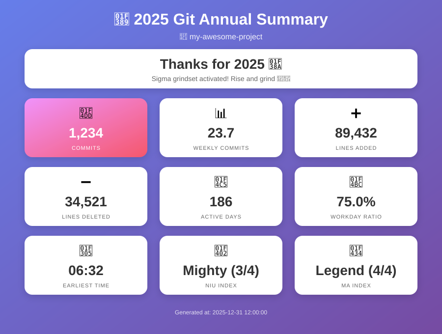

# Git Annual Summary Generator

[English](README.md) | [中文](README_zh.md)

> **2025 is coming to an end.** Time to look back at your commits and celebrate your hard work!

Generate a beautiful HTML report showing your **2025** Git contributions with fun metrics.

**📅 2025 Edition** - This script is specifically designed to summarize your 2025 contributions (Jan 1 - Dec 31, 2025). Run it anytime, even in 2026 or later!

**🔒 100% Local & Private** - Runs entirely on your machine. No data collection, no network requests, no privacy concerns. Your code stats stay with you.



## Features

- **Commit Statistics**: Total commits, weekly average
- **Code Volume**: Lines added/deleted, daily average
- **Activity Tracking**: Active days, workday ratio
- **Time Analysis**: First/last commit date, earliest/latest commit time
- **Fun Metrics**: Niu Index (code volume) & Ma Index (commit frequency)
- **Auto Language**: Detects system language (Chinese/English)

## Usage

### macOS / Linux
```bash
# Download and run
curl -O https://raw.githubusercontent.com/kabimx/niuma-annual-25/main/git-annual.sh
chmod +x git-annual.sh
./git-annual.sh /path/to/repo
```

### Windows
```powershell
# Download git-annual.py from the repository, then run:
python git-annual.py C:\path\to\repo
```

The script will generate an HTML report and open it automatically.

### Force Language

The script auto-detects your system language. To force a specific language:

```bash
# Force English
LANG=en_US.UTF-8 ./git-annual.sh

# Force Chinese
LANG=zh_CN.UTF-8 ./git-annual.sh
```

## Niu & Ma Index

| Index | Level 1 | Level 2 | Level 3 | Level 4 |
|-------|---------|---------|---------|---------|
| **Niu** (daily lines) | Calf (<50) | Bull (<150) | Mighty (<300) | Legend (300+) |
| **Ma** (weekly commits) | Pony (<3) | Racer (<6) | Stallion (<15) | Legend (15+) |

## Requirements

- macOS / Linux
- Git
- Bash 4.0+

## License

MIT License
