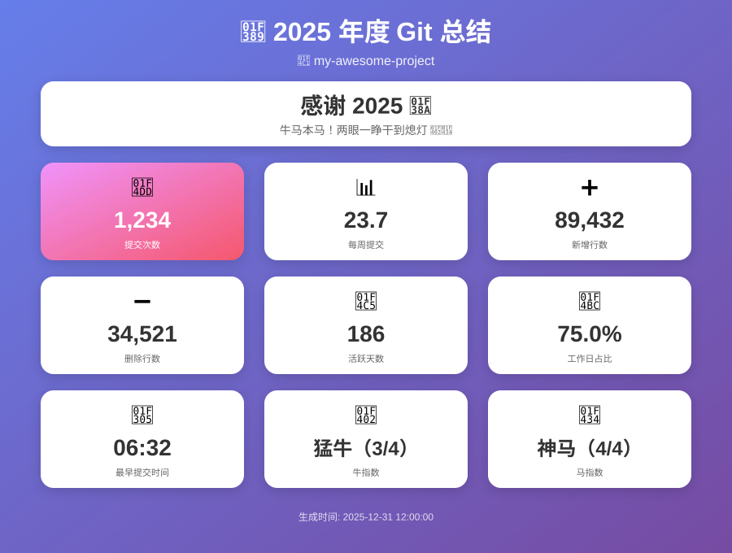

# Git 年度总结生成器

[English](README.md) | [中文](README_zh.md)

> **2025 即将结束。** 是时候回顾这一年的提交，为自己的付出点个赞！

生成精美的 HTML 报告，展示你的 **2025 年度** Git 贡献和趣味指数。

**📅 2025 专属版** - 本脚本专为统计 2025 年度贡献设计（2025年1月1日 - 12月31日）。无论何时运行，即使在2026年或之后，都会统计2025整年数据！

**🔒 100% 本地运行，安全可靠** - 完全在本地执行，不收集任何数据，不发送网络请求，无隐私泄露风险。你的代码统计只属于你。



## 功能特性

- **提交统计**: 总提交数、每周平均提交
- **代码量**: 新增/删除行数、日均代码量
- **活跃度**: 活跃天数、工作日占比
- **时间分析**: 首次/最后提交日期、最早/最晚提交时间
- **趣味指数**: 牛指数（代码量）& 马指数（提交频次）
- **自动语言**: 根据系统语言自动切换中英文

## 使用方法

### macOS / Linux
```bash
# 下载并运行
curl -O https://raw.githubusercontent.com/kabimx/niuma-annual-25/main/git-annual.sh
chmod +x git-annual.sh
./git-annual.sh /path/to/repo
```

### Windows
```powershell
# 从仓库下载 git-annual.py，然后运行：
python git-annual.py C:\path\to\repo
```

脚本会生成 HTML 报告并自动打开。

### 强制指定语言

脚本会自动检测系统语言。如需强制指定语言：

```bash
# 强制英文
LANG=en_US.UTF-8 ./git-annual.sh

# 强制中文
LANG=zh_CN.UTF-8 ./git-annual.sh
```

## 牛马指数说明

| 指数 | 1级 | 2级 | 3级 | 4级 |
|------|-----|-----|-----|-----|
| **牛指数** (日均代码) | 小牛 (<50) | 壮牛 (<150) | 猛牛 (<300) | 神牛 (300+) |
| **马指数** (周均提交) | 小马 (<3) | 快马 (<6) | 烈马 (<15) | 神马 (15+) |

## 系统要求

- macOS / Linux
- Git
- Bash 4.0+

## 许可证

MIT License
